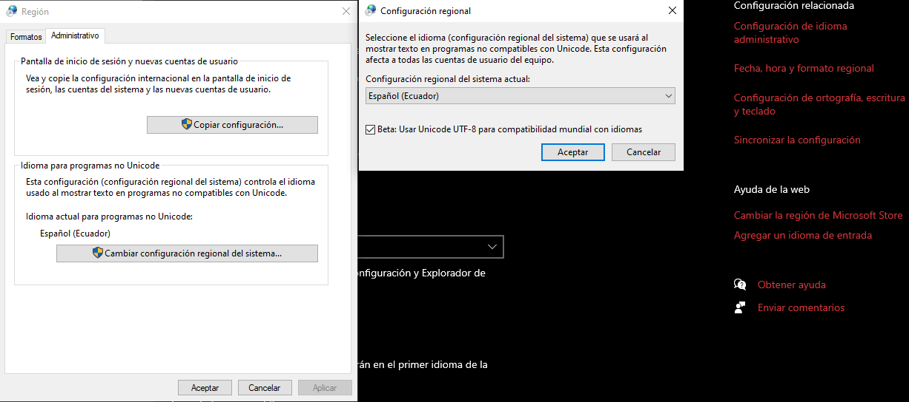

# Inventario Comercial

## Objetivo

Desarrollar una aplicación de consola que integre los conceptos fundamentales de estructuras de datos en C++:
- Acceso y escritura de archivos
- Estructuras lineales estáticas: arreglos y algoritmos de ordenación
- Estructuras lineales estáticas: arreglos unidimensionales y multidimensionales
- Estructuras dinámicas: punteros y listas enlazadas

## Herramientas

- C++
- VSCode

## Instalación

1. Descargar [MinGW-w64](https://sourceforge.net/projects/mingw-w64/files/Toolchains%20targetting%20Win64/Personal%20Builds/mingw-builds/8.1.0/threads-posix/seh/x86_64-8.1.0-release-posix-seh-rt_v6-rev0.7z)
2. Extraer comprimido (.zip)
3. Mover carpeta a la ruta `C:\Program Files\`
4. Agregar `C:\Program Files\mingw64\bin` (binarios) a Variables de Entorno del Sistema
5. Abrir una terminal CMD y ejecutar el comando: `g++ -v`
6. Si el comando no se reconoce se debe actualizar el sistema (F5) o reiniciarlo.
7. Instalar las siguientes extensiones en VSCode:
   - [Code Runner](https://marketplace.visualstudio.com/items?itemName=formulahendry.code-runner)
   - [C/C++ Pack](https://marketplace.visualstudio.com/items?itemName=ms-vscode.cpptools-extension-pack)
8. Configurar Code Runner en VSCode:
   1. Abrir configuraciones de VSCode (`Ctrl+,`)
   2. Buscar "code runner"
   3. Activar las opciones: `Run In Terminal`, `Save All Files Before Run` y `Save File Before Run` 

## Configuración del sistema operativo

<div align="center">

</div>
<br/>

1. Abrir [configuraciones del lenguaje](ms-settings:regionlanguage)
2. En configuración adicional seleccionar Configuración de idioma administrativo
3. Presionar en Cambiar configuración regional del sistema
4. En el cuadro de diálogo activar la opción "Beta: Usar Unicode UTF-8 (...)"
5. Aceptar para guardar la configuración y reiniciar el equipo.

## Compilar y Ejecutar

1. Generar el ejecutable
```
g++ 1.TheMain.cpp -o run
```

2. Ejecutar el archivo `run.exe`

## Resultados

Saludo inicial de la aplicación
<div align="center">

</div>
</br>

Autenticación como administrador
<div align="center">

</div>
</br>

Menú del administrador
<div align="center">

</div>
</br>

Datos de un nuevo registro
<div align="center">

</div>
</br>

Guardado del nuevo registro
<div align="center">

</div>
</br>

Visualización de todos los registros
<div align="center">

</div>
</br>
</br>

## Funcionalidades 

- Registro de productos
- Visualización de productos
- Modificar datos del producto
- Eliminar productos